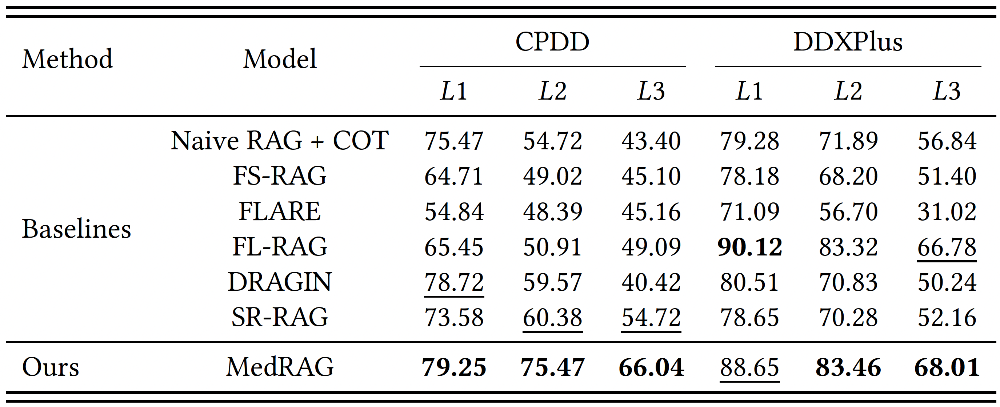
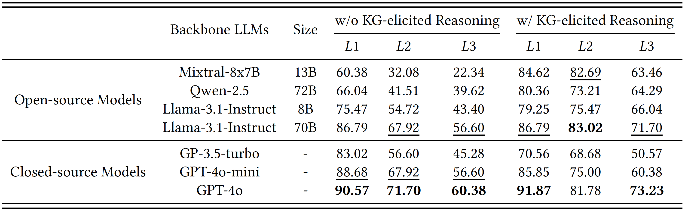
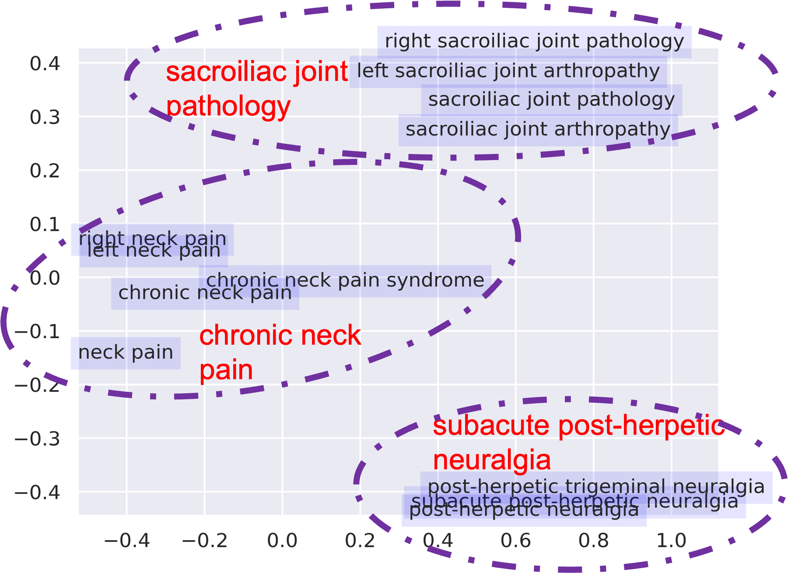

# Project Title: MedRAG: Enhancing Retrieval-augmented Generation with Knowledge Graph-Elicited Reasoning for Healthcare Copilot

**Project Authors**  
*Anonymous*

---

## Project Overview
**MedRAG** is a diagnostic tool designed to enhance **Retrieval-Augmented Generation** (RAG) models by integrating **Knowledge Graph (KG)-elicited reasoning**, specifically for the medical domain. This model helps healthcare professionals retrieve diagnosis and treatment recommendations based on patient manifestations, improving diagnostic accuracy and reducing the risk of misdiagnosis, particularly for diseases with similar manifestations.

---

## About the Project

MedRAG aims to enhance the reasoning capabilities of large language models (LLMs) in the medical domain, especially for complex diagnostic analysis. The model incorporates a disease knowledge graph that encodes relationships between symptoms, diagnoses, and diseases to improve its performance in handling diverse and complex medical cases.

Key features of MedRAG include:

- **Knowledge Graph-Enhanced Reasoning**: Integrates a diagnostic knowledge graph to improve the reasoning ability of the RAG model.
- **Accurate  Diagnostic Support**: Provides specific diagnostic insights and personalized treatment recommendations, even for complex or similar diseases.
- **Follow-Up Question Generation**: Proactively generates relevant follow-up questions to clarify ambiguous patient information and enhance decision-making.
- **Evaluated on Real-World and Public Datasets**: Demonstrated superior performance on the public DDXPlus dataset and a private chronic pain diagnostic dataset (CPDD) compared to existing RAG models.


---

## Core Design of MedRAG: Knowledge Graph-Enhanced Reasonin

The MedRAG approach addresses the following key challenges:

1. **Knowledge Graph Construction**: Using hierarchical aggregation to build diseases knowledge graph, capturing complex relationships between diseases, categories, and their manifestations.
2. **RAG-Based Reasoning**: Combines EHR retrieval with diagnostic knowledge graph reasoning to enhance diagnostic accuracy.
3. **Personalized Diagnostic Suggestions**: Integrates multi-level information to provide personalized treatment and follow-up recommendations.

---

## Dataset Download

### Full Test Set

The full MedRAG test set, including raw image data and annotations, can be downloaded from the links below. Due to the large size of the dataset, a lighter version is also available for quicker testing.

- [Download Full DDXPlus](https://figshare.com/articles/dataset/DDXPlus_Dataset_English_/22687585) **: a large-scale, synthesized EHR dataset widely recognized for offering complex, diverse medical diagnosis cases. It includes comprehensive patient data such as socio-demographic information, underlying diseases, symptoms, and antecedents.
- [Download Full CCPD](#https://github.com/username00-c/MedRAG/)

## Usage

To use this project, follow these steps:

1. **Clone this repository**  
   First, clone this repository to your local machine:

   ```bash
   git clone https://github.com/yourusername/yourrepository.git
2. **Modify Tokens**  
   To use your own OpenAI and Hugging Face API tokens, replace the placeholders in the source code with your actual tokens. The relevant sections in the code have been left blank for this purpose.
   
   ```python
   # Replace with your OpenAI API token
   api_key = "your_openai_api_token"   
  
   # Replace with your Hugging Face API token
   hf_token = "your_huggingface_api_token"
4. **Run the `main.py` script**  
   Once the paths and tokens have been updated, run the `main.py` file to start the program:
   
   ```python
   python main.py

## Experimental Results
### Comparison of Diagnostic Accuracy


*Figure 1: Results of quantitative performance comparison.*

### KG-elicited reasoning Performance


*Figure 2: Performance of MedRAG on different LLM backbones with and without KG-elicited reasoning.*


### Additional Visualizations
1. Diseases knowledge graph

*Figure 2: The result of hierarchical aggregation in CPDD.*

*Figure 2: The result of hierarchical aggregation in CPDD.*

2. Clustering result demonstration

*Figure 2: The result of disease clustering in CPDD.*
---


